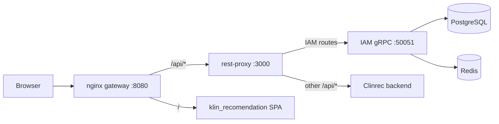

# Контекст проекта для LLM

> **Назначение документа:** полный контекст микросервисной медицинской информационной системы для создания/исполнения/сравнения схем клинических рекомендаций в BPMN-подобной нотации. Документ подготовлен для передачи другой LLM (научная работа, доработка тестов, написание статьи).
>
> **Дата актуализации:** 2026-05-20

---

## 1. Научная работа — предмет и цели

Разрабатывается программный комплекс для медицинских информационных систем (МИС), включающий **четыре подсистемы**:

| № | Подсистема | Репозиторий | Краткое описание |
|---|-----------|-------------|------------------|
| 1 | **Редактор схем клинических рекомендаций (klin-rec)** | `klin_recomendation/` | SPA для создания/редактирования графовых алгоритмов в нотации, похожей на BPMN |
| 2 | **Стратегии промптинга для сравнения графов** | `klin_recomendation/src/comparison/` | Структурный diff двух схем + формирование промптов для LLM-анализа |
| 3 | **Движок исполнения визуальных алгоритмов** | `klin_recomendation/src/engine/` | Интерпретатор графа: условия, циклы, подпроцессы, пауза на ввод данных пациента |
| 4 | **IAM / API Gateway** | `iam-service/` (+ `iam-admin-panel/`) | Централизованная аутентификация, RBAC/ABAC, REST-прокси к Clinrec backend |

**Связанные, но отдельные проекты (не входят в научную работу по klin-rec):**
- `PhantiK_frontend/`, `PhantiK_backend/` — детское приложение задач/наград (backend пустой)
- `iam-admin-panel/` — React-админка для IAM (управление пользователями, ролями, правами)

---

## 2. Структура workspace

```
/Users/lsofa/
├── klin_recomendation/     # Основной frontend + engine + comparison
├── iam-service/            # IAM gRPC + REST proxy + nginx gateway
├── iam-admin-panel/        # Админ-панель IAM
├── PhantiK_frontend/       # Не связан с klin-rec
└── PhantiK_backend/        # Пустой scaffold (Go planned, нет кода)
```

---

## 3. Архитектура системы



**Порты:**
- `5173` — Vite dev (frontend)
- `3000` — REST proxy (iam-service)
- `50051` — gRPC IAM
- `8080` — nginx gateway (docker-compose)

**Dev proxy:** `vite.config.ts` проксирует `/api` → `http://127.0.0.1:3000`

---

## 4. Репозиторий `klin_recomendation`

### 4.1. Tech stack

| Слой | Технология |
|------|------------|
| Build | Vite 5, TypeScript 5 |
| UI | React 18, @gravity-ui/uikit, SCSS Modules |
| Flow editor | @xyflow/react |
| State | MobX + mobx-react-lite |
| Routing | React Router 7 |
| HTTP | Axios + JWT (localStorage) |
| **Tests** | Vitest 4, @vitest/coverage-v8, @testing-library/react |
| Deploy | Docker (nginx), GitHub Actions |

### 4.2. Структура каталогов

```
klin_recomendation/
├── src/
│   ├── api/                    # HTTP-слой
│   │   ├── apiClient.ts        # Axios + JWT + 401
│   │   ├── authService.ts, authStorage.ts, authTypes.ts
│   │   ├── recommendationService.ts
│   │   ├── executionService.ts
│   │   ├── comparisonService.ts    # GET /compare/:id1/:id2
│   │   ├── clinrecProcessMapper.ts # Domain ↔ BackendData ↔ React Flow
│   │   ├── comparisonTypes.ts
│   │   └── types.ts
│   ├── comparison/             # НОВЫЙ модуль (2026-05-20)
│   │   ├── graphDiff.ts        # compareGraphs()
│   │   ├── promptStrategies.ts # buildComparisonPrompt(), 4 стратегии
│   │   └── index.ts
│   ├── engine/                 # Движок исполнения
│   │   ├── ExecutionEngine.ts
│   │   ├── nodeHandlers.ts     # start/finish/action/condition/subprocess/loop
│   │   ├── conditionEvaluator.ts
│   │   ├── types.ts
│   │   └── README.md, PAUSING_EXECUTION.md
│   ├── stores/
│   │   ├── BpmnStore.tsx
│   │   ├── BpmnBackEdit.tsx    # transformBackendData()
│   │   ├── recommendationStore.ts
│   │   └── authStore.ts
│   ├── pages/
│   │   ├── FlowEditorPage.tsx
│   │   ├── ExecutionPage.tsx
│   │   ├── ComparisonPage.tsx
│   │   └── LoginPage.tsx, RegisterPage.tsx
│   ├── components/
│   │   ├── FlowEditor/
│   │   ├── ProcessComparison/
│   │   ├── Recommendations/
│   │   └── typesNodes/         # Start, Finish, Action, Condition, Subprocess, Loop
│   └── utils/permissions.ts
├── scripts/coverage-report.mjs # Генератор отчёта для научной работы
├── coverage-report/            # COVERAGE_REPORT.md, dashboard HTML, JSON
├── vitest.config.ts
├── SCIENTIFIC_DESCRIPTION.md   # Описание движка для статьи
└── package.json
```

### 4.3. Типы узлов BPMN-редактора

| Backend type | React Flow type | Назначение |
|-------------|-----------------|------------|
| 0 | start | Начало |
| 1 | finish | Конец |
| 2 | condition | Условие (ветки ДА/НЕТ) |
| 3 | action | Действие |
| 4 | subprocess | Подпроцесс |

### 4.4. Ключевые API endpoints (через `/api`)

| Метод | Путь | Описание |
|-------|------|----------|
| POST | `/api/login` | Аутентификация |
| GET/PUT | `/api/v1/process` | CRUD процессов Clinrec |
| GET | `/api/compare/:id1/:id2` | Сравнение двух схем (backend) |

---

## 5. Модуль сравнения графов и промптинга

**Путь:** `src/comparison/`

### 5.1. `graphDiff.ts` — `compareGraphs(process1, process2)`

Структурное сравнение двух `BackendData`:
- **nodes:** added, removed, modified (label/position/type), unchanged
- **edges:** added, removed, modified (source/target/label/data), unchanged
- **summary:** счётчики изменений

Используется для локального diff; UI также вызывает backend `comparisonService.compare()`.

### 5.2. `promptStrategies.ts` — стратегии для LLM

| ID | Описание |
|----|----------|
| `zero_shot` | Прямой запрос: сравни схемы, опиши клиническое значение |
| `chain_of_thought` | Пошаговый анализ: структура → последовательность → решения → риски |
| `structured_json` | Запрос JSON: `structural_diff`, `clinical_impact`, `risk_level`, `recommendations[]` |
| `few_shot` | Пример клинической интерпретации diff + аналогичный запрос для новой пары |

**API:**
```typescript
buildComparisonPrompt(comparison, { strategy, language?: 'ru' | 'en' })
buildAllStrategyPrompts(comparison, language?)
```

---

## 6. Движок исполнения (`src/engine/`)

### 6.1. Компоненты

| Компонент | Файл | Роль |
|-----------|------|------|
| ExecutionEngine | ExecutionEngine.ts | Оркестрация: поиск start, цикл выполнения, лимиты |
| NodeHandlerFactory | nodeHandlers.ts | Фабрика обработчиков по типу узла |
| ActionNodeHandler | nodeHandlers.ts | Действия, `patient.*` updates, `require:` пауза |
| ConditionNodeHandler | nodeHandlers.ts | Сравнение через атрибуты или ConditionEvaluator |
| SubprocessNodeHandler | nodeHandlers.ts | Рекурсивный вызов подпроцесса |
| LoopNodeHandler | nodeHandlers.ts | Итерации с exit condition |
| ConditionEvaluator | conditionEvaluator.ts | Выражения: `age > 18`, `has('key')`, русский текст |

### 6.2. Защита от зацикливания

- maxSteps (default 1000)
- timeout (default 30s)
- visit count per node (limit 50)

### 6.3. ExecutionContext

```typescript
{
  patientData: Record<string, any>,
  variables: Record<string, any>,
  executionHistory: ExecutionStep[],
  currentPath: string[],
  updatePatientData?: (updates) => void
}
```

### 6.4. ConditionNodeHandler — упрощённые атрибуты

| Атрибут | Пример | Описание |
|---------|--------|----------|
| inputField | `systolicBP` | Поле пациента |
| inputType | `number` | number / text / boolean |
| compareOperator | `>` | =, !=, <, > |
| compareValue | `140` | Порог сравнения |
| hint | текст | Подсказка при паузе |

---

## 7. Репозиторий `iam-service`

### 7.1. Tech stack

Node.js 20, TypeScript, gRPC, Express 5, PostgreSQL (Prisma), Redis, JWT, Jest 29

### 7.2. Структура

```
iam-service/
├── src/
│   ├── server.ts              # gRPC entrypoint
│   ├── services/
│   │   ├── user.service.ts    # Login, JWT sessions
│   │   ├── role.service.ts
│   │   └── permission.service.ts
│   ├── core/
│   │   ├── policy-engine.ts   # ABAC: ownerOnly, allowedStatuses, specialtyMatch, departmentMatch
│   │   └── cache-manager.ts   # Redis cache
│   ├── middleware/auth.js     # JWT middleware для rest-proxy
│   └── clients/clinrec-client.ts
├── rest-proxy.js              # Express: IAM routes + proxy /api/* → Clinrec
├── gateway/nginx.conf
├── prisma/schema.prisma
└── tests/                     # 8 test files, 23 tests
```

### 7.3. PolicyEngine conditions

- `ownerOnly` — только владелец ресурса
- `allowedStatuses` — допустимые статусы (PUBLISHED, DRAFT)
- `specialtyMatch` — совпадение специальности врача
- `departmentMatch` — совпадение отделения

---

## 8. Автотесты — полный перечень

### 8.1. klin_recomendation — 43 теста (8 файлов), Vitest

| Файл | Тест-кейсы |
|------|------------|
| `src/comparison/graphDiff.test.ts` | identical graphs, added/removed nodes, modified label, edge diff |
| `src/comparison/promptStrategies.test.ts` | zero_shot, chain_of_thought, structured_json, few_shot, buildAllStrategyPrompts, EN lang |
| `src/api/clinrecProcessMapper.test.ts` | normalizeProcessList, domainProcessToBackendData, resolveNodeIdThroughRemap, flowEditorStateToBackendData, condition edges ДА/НЕТ, backendDataToClinrecProcess |
| `src/utils/permissions.test.ts` | wildcard */*, exact match, hasAnyPermission, empty list |
| `src/engine/conditionEvaluator.test.ts` | numeric comparison, has(), variables, invalid expr, logical AND |
| `src/engine/nodeHandlers.test.ts` | Factory, Start, Finish, Action (edge, patient update, require pause), Condition (true/false branch) |
| `src/engine/ExecutionEngine.test.ts` | linear start→finish, unknown process, condition branch, maxSteps limit |
| `src/App.test.tsx` | App export smoke |

### 8.2. iam-service — 23 теста (8 файлов), Jest

| Файл | Тест-кейсы |
|------|------------|
| `tests/policy-engine.test.ts` | empty perms, empty conditions, ownerOnly, allowedStatuses, specialtyMatch, departmentMatch, constraints |
| `tests/auth.middleware.test.js` | public /api/login, no token 401, valid JWT, invalid token |
| `tests/permission.service.test.ts` | permission checks (mocked Prisma/cache) |
| `tests/user.service.test.ts` | create user, duplicate email |
| `tests/clinrec-client.test.ts` | HTTP client CRUD process |
| `tests/clinrec-openapi.test.ts` | OpenAPI snapshot contract |
| `tests/config.test.ts` | URL normalization |
| `tests/rest-proxy.test.js` | createRestProxyApp smoke |

**Итого: 66 автотестов, все проходят.**

---

## 9. Покрытие кода (coverage)

### 9.1. Сводная таблица по подсистемам

| № | Система | Lines | Statements | Functions | Branches |
|---|---------|-------|------------|-----------|----------|
| 1 | Редактор схем (klin-rec) | 53.2% | 52.6% | 64.3% | 44.0% |
| 2 | Промптинг / сравнение графов | 75–79%* | 76–77%* | 75–91%* | 59–65%* |
| 3 | Движок исполнения | 37–59%* | 37–58%* | 46–67%* | 21–44%* |
| 4 | IAM / API Gateway | **61.3%** | **59.8%** | **56.1%** | **55.0%** |

\* по ключевым модулям подсистемы

### 9.2. Детализация по модулям

**klin-rec:**
| Модуль | Lines | Statements | Functions | Branches |
|--------|-------|------------|-----------|----------|
| clinrecProcessMapper | 90.8 | 78.4 | 95.2 | 64.4 |
| permissions | 100.0 | 93.3 | 100.0 | 71.4 |

**comparison:**
| Модуль | Lines | Statements | Functions | Branches |
|--------|-------|------------|-----------|----------|
| graphDiff | 75.5 | 76.3 | 90.9 | 59.3 |
| promptStrategies | 79.2 | 76.9 | 75.0 | 65.0 |

**engine:**
| Модуль | Lines | Statements | Functions | Branches |
|--------|-------|------------|-----------|----------|
| ExecutionEngine | 45.3 | 45.6 | 46.1 | 38.6 |
| nodeHandlers | 59.0 | 57.7 | 66.7 | 44.0 |
| conditionEvaluator | 36.8 | 36.8 | 53.1 | 21.0 |

**iam-service:**
| Модуль | Lines | Statements | Functions | Branches |
|--------|-------|------------|-----------|----------|
| policy-engine | **100.0** | **100.0** | **100.0** | 96.9 |
| permission.service | 56.5 | 55.4 | 54.5 | 33.3 |
| user.service | 26.4 | 25.7 | 14.3 | 15.8 |
| clinrec-client | 80.0 | 75.9 | 91.7 | 44.8 |
| config | 87.5 | 87.5 | 100.0 | 51.6 |

### 9.3. Артефакты отчёта

```
klin_recomendation/coverage-report/
├── COVERAGE_REPORT.md       # Markdown-таблицы + ASCII-графики
├── coverage-dashboard.html  # Chart.js bar + radar
└── coverage-data.json     # JSON для программной обработки
```

---

## 10. Команды

```bash
# === klin_recomendation ===
cd /Users/lsofa/klin_recomendation
npm install
npm run dev              # http://localhost:5173
npm test                 # 43 теста
npm run test:coverage    # coverage v8
npm run coverage:report  # полный отчёт (klin + iam)

# === iam-service ===
cd /Users/lsofa/iam-service
npm install
npm run dev              # gRPC :50051 + REST :3000
npm test                 # 23 теста
npm run test:coverage

# === docker stack ===
cd /Users/lsofa/iam-service && docker compose up
```

---

## 11. Конфигурация тестов

### Vitest (`klin_recomendation/vitest.config.ts`)

- **environment:** `node` (jsdom отключён из-за ESM-конфликта с css-color)
- **pool:** `threads`
- **coverage include:** `engine/**`, `comparison/**`, `clinrecProcessMapper.ts`, `permissions.ts`
- **coverage exclude:** `*.test.ts`, `index.ts`, `example.ts`

### Jest (`iam-service/jest.config.js`)

- **collectCoverageFrom:** `src/**/*.ts` (exclude `generated/**`, `server.ts`)
- **coverageReporters:** text, html, json-summary
- **setup:** `tests/jest.env.setup.js` (CLINREC_BASE_URL)

---

## 12. Что было сделано в последней сессии (2026-05-20)

1. **Создан модуль `src/comparison/`** — graphDiff + 4 стратегии промптинга
2. **Добавлены тесты:** clinrecProcessMapper (10), permissions (4), graphDiff (4), promptStrategies (6)
3. **Расширены тесты engine:** ConditionNodeHandler, ActionNodeHandler patient/require, ExecutionEngine condition/maxSteps
4. **iam-service:** auth.middleware.test.js (4), policy-engine departmentMatch + constraints
5. **Скрипт `scripts/coverage-report.mjs`** — генерация MD + HTML dashboard + JSON
6. **Исправлен vitest.config** — node environment вместо jsdom (ESM bug)

---

## 13. Известные ограничения и пробелы

| Область | Статус |
|---------|--------|
| SubprocessNodeHandler, LoopNodeHandler | **Нет unit-тестов** |
| conditionEvaluator (русский текст, АД, nested fields) | **Низкое покрытие (~37%)** |
| ExecutionEngine (subprocess, loop, pause/resume) | **Частичное покрытие (~45%)** |
| UI-компоненты (React Flow editor, pages) | **Не тестируются** (jsdom сломан) |
| iam user.service | **~26% coverage** |
| auth.middleware, rest-proxy.js | **Не в collectCoverageFrom** (файлы вне src/) |
| CI (GitHub Actions) | **Тесты не запускаются** — только deploy Docker |
| Backend Clinrec (сравнение `/compare`) | **Отдельный сервис**, не в этом workspace |
| PhantiK_backend | **Пустой репозиторий** |

---

## 14. Документы для научной статьи

| Файл | Содержание |
|------|------------|
| `SCIENTIFIC_DESCRIPTION.md` | Архитектура движка исполнения, алгоритмы, типы данных |
| `EXECUTION_ENGINE_SIMPLIFICATION.md` | Упрощение ConditionNodeHandler |
| `CONDITION_NODE_ATTRIBUTES.md` | Атрибуты condition-узлов |
| `EXECUTION_ENGINE_GUIDE.md` | Руководство пользователя |
| `coverage-report/COVERAGE_REPORT.md` | Таблицы покрытия для раздела «Тестирование» |
| `coverage-report/coverage-dashboard.html` | Графики для иллюстраций |

---

## 15. Рекомендации для следующей LLM

### Если нужно написать раздел статьи «Тестирование»:
- Использовать таблицы из раздела 9
- Указать 66 автотестов, Vitest + Jest
- Описать 4 стратегии промптинга как методологический вклад

### Если нужно повысить coverage:
1. `SubprocessNodeHandler` / `LoopNodeHandler` — mock BpmnStore, recursive execute
2. `conditionEvaluator` — русские условия («АД < 140/90», «Есть кашель»)
3. `user.service` — login, refresh token, session expiry
4. Добавить `collectCoverageFrom` для `rest-proxy.js`, `auth.js`

### Если нужно починить UI-тесты:
- Downgrade jsdom до 24.x или заменить на happy-dom
- Либо `@vitest-environment jsdom` только для `*.test.tsx`

### Если нужен CI:
```yaml
# .github/workflows/test.yml
- run: npm test
  working-directory: klin_recomendation
- run: npm test
  working-directory: iam-service
```

---

## 16. Ключевые пути файлов (quick reference)

```
# Comparison + prompting
klin_recomendation/src/comparison/graphDiff.ts
klin_recomendation/src/comparison/promptStrategies.ts

# Execution engine
klin_recomendation/src/engine/ExecutionEngine.ts
klin_recomendation/src/engine/nodeHandlers.ts
klin_recomendation/src/engine/conditionEvaluator.ts

# Schema mapping
klin_recomendation/src/api/clinrecProcessMapper.ts
klin_recomendation/src/stores/BpmnBackEdit.tsx

# IAM
iam-service/src/core/policy-engine.ts
iam-service/rest-proxy.js
iam-service/src/middleware/auth.js

# Coverage report
klin_recomendation/scripts/coverage-report.mjs
klin_recomendation/coverage-report/
```

---

*Конец документа. Для обновления coverage: `cd klin_recomendation && npm run coverage:report`*
